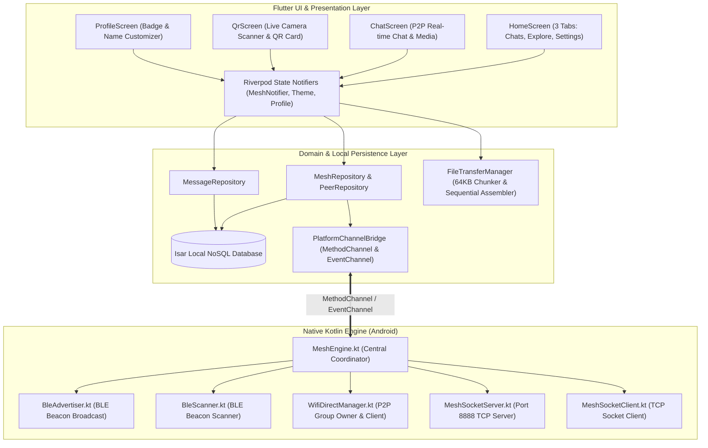
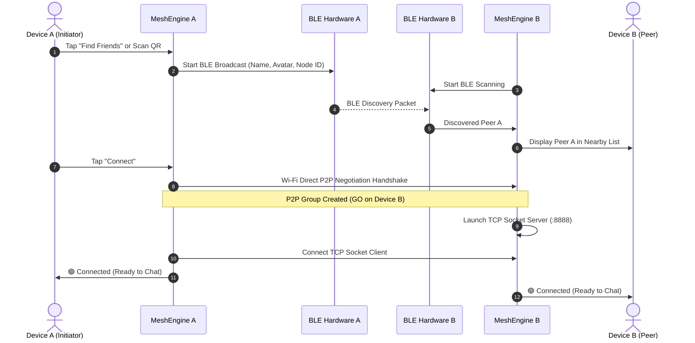
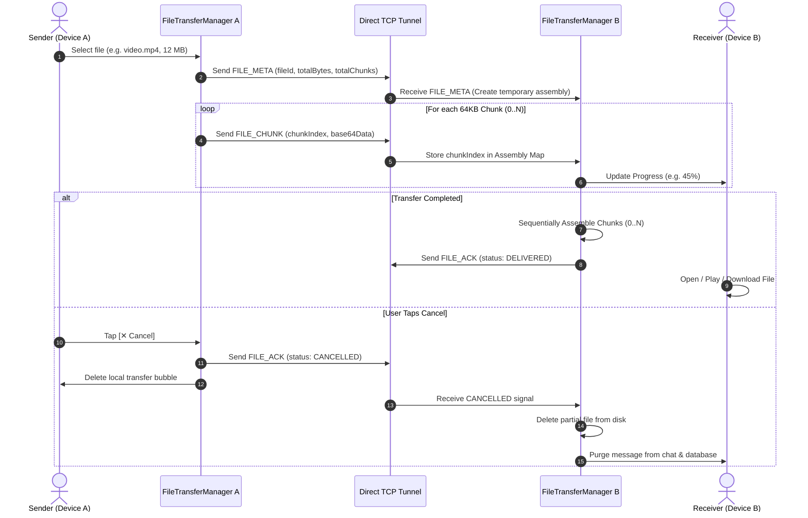

# 🌐 MeshLink — Complete Product & Technical Documentation

---

## 📌 1. What is MeshLink?

**MeshLink** is a **100% off-grid, decentralized, serverless peer-to-peer (P2P) messaging and multimedia sharing application** for Android. 

It lets users chat, send photos, stream videos, and transfer large documents (PDFs, ZIPs, APKs, DOCs) directly with nearby friends **without using the Internet, mobile data, cellular towers, or external Wi-Fi routers**. 

By turning every Android phone into an autonomous wireless node using **Bluetooth Low Energy (BLE)** for discovery and **Wi-Fi Direct (P2P Sockets)** for high-speed transmission, MeshLink creates an instant, localized, self-healing communication grid right out of thin air.

---

## 🎯 2. What Problem Does It Solve? (Purpose & Real-World Use Cases)

Modern communication apps (WhatsApp, Telegram, Signal) depend completely on central cloud servers, telecom carriers, and ISP infrastructure. When internet or mobile towers fail, standard communication is disabled.

MeshLink delivers **100% offline, resilient, private, and zero-trust communication**:

| Scenario | How MeshLink Helps |
| :--- | :--- |
| 🌪️ **Natural Disasters & Blackouts** | Earthquakes, floods, storms, and power outages often knock out cellular towers. MeshLink enables first responders, rescue teams, families, and neighbors to coordinate across hundreds of meters with zero infrastructure. |
| 🏔️ **Remote Hiking, Camping & Expeditions** | Mountains, forests, and remote backcountry trails have zero cellular reception. MeshLink allows trekking groups to exchange messages, GPS coordinates, and media. |
| 🏟️ **Crowded Events & Stadiums** | When tens of thousands of people congest mobile towers, standard 4G/5G data halts. MeshLink establishes direct peer-to-peer links that bypass overloaded mobile networks completely. |
| ✈️ **Flights & Underground Metros** | In Airplane Mode or deep underground subways without public Wi-Fi, passengers can message and share files directly device-to-device. |
| 🔒 **Maximum Privacy & Anti-Surveillance** | Zero accounts, zero phone number registrations, zero cloud servers, and zero metadata logs. Communications are private to the physical radio link. |

---

## ⚙️ 3. How Does It Work? (The Dual-Channel Wireless Engine)

MeshLink operates a **smart dual-channel wireless pipeline** that combines the battery efficiency of Bluetooth with the high bandwidth of Wi-Fi Direct:

```
 ┌────────────────────────────────────────────────────────┐
 │                     Device A (Phone 1)                 │
 └──────────────────────────┬─────────────────────────────┘
                            │
              1. Discovery  │ (Bluetooth Low Energy Beacon)
              "I'm here!    │  Ultra-low power, background
               Node: 8a4f"  ▼
 ┌────────────────────────────────────────────────────────┐
 │                     Device B (Phone 2)                 │
 └──────────────────────────┬─────────────────────────────┘
                            │
              2. Fast Link  │ (Wi-Fi Direct P2P)
              High-Speed    │  Direct Wi-Fi connection
              Socket Setup  ▼  (Up to 100m range, 250+ Mbps)
 ┌────────────────────────────────────────────────────────┐
 │        3. Real-Time Chat & Multimedia Over TCP         │
 └──────────────────────────┬─────────────────────────────┘
```

### Phase 1: Background Presence Discovery (Bluetooth Low Energy)
- When **"Find Friends Nearby"** is enabled, the phone broadcasts a lightweight BLE advertisement beacon containing the display name, avatar index, and randomized node ID.
- Nearby devices passively scan for these beacons and display the friend in the **Explore** tab without establishing high-power connections.

### Phase 2: High-Speed Direct Tunnel Handshake (Wi-Fi Direct)
- When a user taps **Connect** or scans a **QR Code**, the devices execute an autonomous Wi-Fi Direct handshake (`WifiP2pManager`).
- One phone assumes the Group Owner (GO) role and hosts an internal TCP socket server on port `8888`, while the peer joins as a client.

### Phase 3: Real-Time Messaging & Chunked File Streaming
- **Text Messages**: Delivered over the active TCP stream with sub-millisecond latency and instant delivery ACKs (`✓✓`).
- **High-Speed File & Media Sharing**:
  - Files (Images, Videos, PDFs, ZIPs, APKs) are chunked into **64 KB binary packets** with index-based metadata.
  - Chunks are transmitted over the TCP tunnel and reassembled sequentially on the receiving end.
  - An interactive **Cancel Send** control allows either peer to abort an in-flight transfer at any time, instantly deleting partial data and purging incomplete bubbles.

---

## 📱 4. App Features & User Experience

```
┌──────────────────────────────────────────────────────────┐
│                         MeshLink                         │
├──────────────────────────────────────────────────────────┤
│                                                          │
│  [💬 Chats]               [📡 Explore]      [⚙️ Settings] │
│                                                          │
│  • WhatsApp style list    • Status pill      • Profile   │
│  • File / Media preview   • Saved Friends    • Theme     │
│  • Hold-to-delete chat    • Nearby Friends     (Cream/   │
│  • 🟢 Live status dot     • 🔘 Scan QR (FAB)   Dark)     │
│                                                          │
└──────────────────────────────────────────────────────────┘
```

### 💬 Tab 1: Chats (Conversation Hub)
- **WhatsApp-Style Chat List**: Shows active and saved peer conversations with clean display names, unread indicators, and message timestamps.
- **Media & Document Previews**: Shows `📷 Photo`, `🎥 Video`, and `📄 Document [filename]` previews in the chat list.
- **Hold-to-Delete Individual Messages**: Long-press any chat bubble to bring up the delete confirmation dialog and remove it from on-device storage.
- **Delete Conversation vs. Forget Friend**: Long-press a chat tile to delete message history without unfriending the peer.
- **Status Indicator**: `🟢 Connected` (ready for live offline messaging) or `⚪ Saved Friend` (offline).

### 📡 Tab 2: Explore (Discovery & Peer Management)
- **Real-Time Status Pill**:
  - `● Connected` (Emerald glow) — Real-time mesh socket link active.
  - `● Searching` (Cyan glow) — Actively scanning for nearby devices.
  - `● Ready` (Muted) — Bluetooth radio ready to discover.
- **Saved Friends Section**: Shows paired friends with quick "Connect" buttons. Includes a dedicated **Forget Friend** action to remove pairings.
- **Nearby Friends Section**: Live list of newly discovered peers in range.
- **QR Code FAB**: Instant bottom-right button to launch the QR scanner.

### ⚙️ Tab 3: Settings & Profile
- **Profile Customization**: Choose your display name, status tagline, and avatar badge.
- **Dual-Theme Engine**:
  - **Light Theme**: Soothing warm cream & beige background (`#F6F3EC`), ivory card surfaces (`#FDFBF7`), lush emerald accents (`#00896B`), and espresso typography (`#231F1C`).
  - **Dark Theme**: Deep charcoal background (`#0B0F14`), slate cards (`#151B23`), vibrant mint accents (`#00D4A8`), and crisp white typography.
- **Node Fingerprint ID**: View and copy your hardware cryptographic node ID.

### 📷 Pure QR Pairing Flow
- **Scan QR**: Live camera QR scanner with auto-focus, torch toggle, switch camera, and Gallery image QR decoder.
- **My QR**: Full-screen high-contrast QR code with profile avatar badge, display name, and node ID for instant scanning.

### 📁 In-App Media & File Sharing
- **In-App Video Player**: Watch received MP4/MKV videos directly inside MeshLink with custom play/pause/seek controls, or switch to external hardware player for 4K/HEVC videos.
- **Universal Document Viewer**: Open PDFs, DOCs, ZIPs, APKs, and audio files instantly using Android's native "Open with..." app picker via secure `FileProvider`.
- **Save to Downloads**: Download received attachments directly to public device storage (`Download/MeshLink/`).
- **Interactive Cancel Transfer**: Tap `[✕ Cancel]` on the progress bar during any transfer to abort the stream and automatically remove incomplete files.

---

## 🏛️ 5. Technical System Architecture



---

## 🔄 6. Detailed Interaction Sequence Diagrams

### A. Device Discovery & Direct Socket Connection



### B. High-Speed File Transfer with Cancellation Flow



---

## ❓ 7. Frequently Asked Questions (FAQ)

### 📡 Q1: What is the real-world range of MeshLink?
- **Outdoors (Line-of-Sight)**: **50 to 100+ meters**. In open fields, parks, or streets, Wi-Fi Direct signals easily reach over 100 meters.
- **Indoors (Buildings / Homes)**: **20 to 40 meters**, passing through standard drywall and residential walls.

---

### ⚡ Q2: How fast is file and media transfer?
- Unlike Bluetooth transfer speeds (~1-2 Mbps), MeshLink operates over **Wi-Fi Direct (2.4 GHz / 5 GHz)** achieving real-world speeds of **50 Mbps to 250+ Mbps**. A 50 MB video or PDF transfers in a few seconds.

---

### 🛑 Q3: What happens if I cancel a file while it is sending?
- Tapping **Cancel** immediately stops chunk transmission. MeshLink transmits a cancellation packet over the network, deleting the incomplete chunks on the receiver's disk and removing the cancelled card completely from both devices.

---

### 🗄️ Q4: Is chat history preserved after closing or restarting the app?
- **Yes.** All text messages, peer profiles, and file metadata are permanently stored in an on-device embedded **Isar NoSQL database**.

---

### 🔋 Q5: Does running MeshLink drain battery quickly?
- **No.** Idle background discovery uses Bluetooth Low Energy (BLE) consuming less than **15 mW** of power. High-speed Wi-Fi Direct sockets only activate during active messaging or file transfer sessions.

---

### 🔒 Q6: Can third parties intercept our messages?
- **No.** Connections are strictly direct point-to-point Wi-Fi Direct sockets between the two physical devices. There are no cloud intermediaries, servers, or broadcast logs.

---

## 🛠️ 8. Tech Stack & Dependencies

- **Framework**: Flutter 3.x (Dart 3.x)
- **Native Platform**: Kotlin 1.9+ (Android SDK 26–34)
- **State Management**: Flutter Riverpod
- **Local Database**: Isar Database (Embedded NoSQL)
- **Camera & QR**: `mobile_scanner`, `qr_flutter`
- **Video & Media**: `video_player`, `open_filex`, `image_picker`, `file_picker`
- **Typography & Theme**: Google Fonts (Inter)
