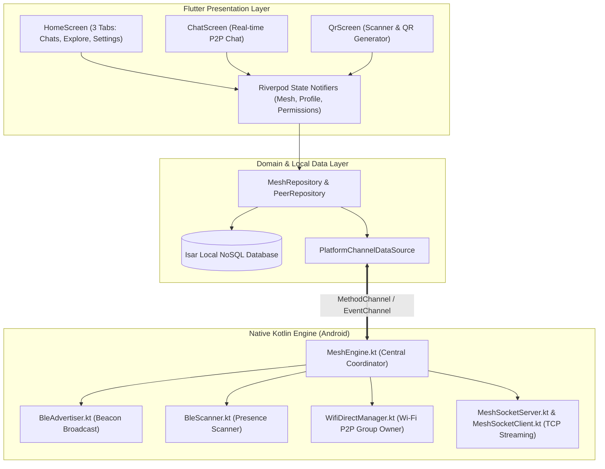
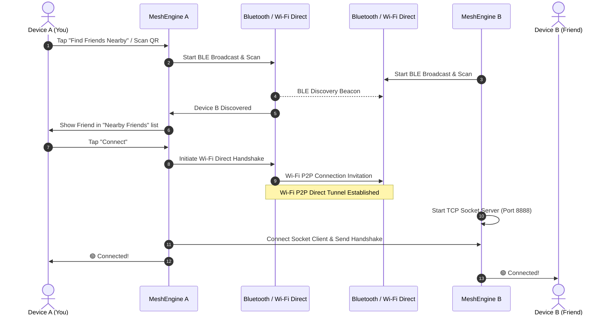
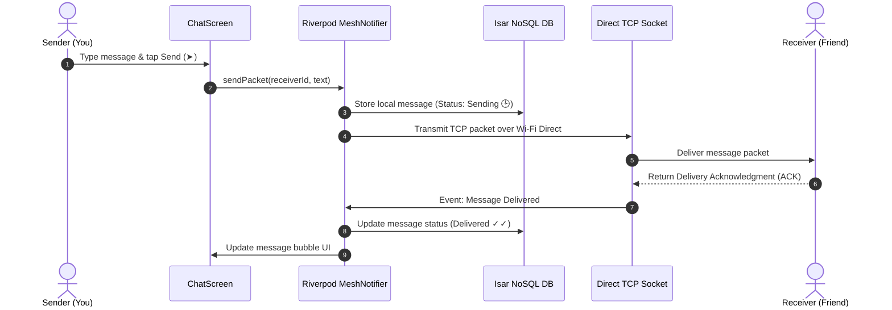

# 🌐 MeshLink — Complete Product & Technical Documentation

---

## 📌 1. What is MeshLink?

**MeshLink** is an **off-grid, decentralized, serverless peer-to-peer (P2P) messaging application** for Android. 

It lets people chat directly with nearby friends **without using the Internet, mobile data, cellular towers, or Wi-Fi routers**. 

By turning every Android phone into an independent node that communicates directly with nearby phones over **Bluetooth Low Energy (BLE)** and **Wi-Fi Direct**, MeshLink creates a localized, self-healing wireless network right out of thin air.

---

## 🎯 2. What Problem Does It Solve? (Purpose & Real-World Use Cases)

Modern communication apps (WhatsApp, Telegram, Signal) depend 100% on central servers, internet service providers (ISPs), and mobile cell towers. When internet infrastructure goes down, you lose communication.

MeshLink solves this by offering **100% offline, resilient, private communication**:

| Scenario | How MeshLink Helps |
| :--- | :--- |
| 🌪️ **Natural Disasters & Emergencies** | Earthquakes, floods, hurricanes, or power outages often knock down cell towers. MeshLink enables rescue teams, families, and neighbors to stay in touch without any power grid or telecommunication lines. |
| 🏔️ **Remote Hiking, Camping & Trekking** | Mountains, forests, and remote trails have zero cellular reception. MeshLink allows trekking groups to stay coordinated across hundreds of meters. |
| 🏟️ **Crowded Events, Stadiums & Festivals** | When 50,000+ people overwhelm mobile towers, regular 4G/5G data freezes. MeshLink bypasses congested towers entirely via direct device-to-device wireless links. |
| ✈️ **Flights & Subways** | In airplane mode or deep underground metros without Wi-Fi, passengers can message each other directly. |
| 🔒 **Maximum Privacy & Anti-Surveillance** | Zero servers, zero accounts, zero phone number registrations, and zero metadata logs. No third party can snoop on or censor local conversations. |

---

## ⚙️ 3. How Does It Work? (The Technology Explained Simply)

MeshLink uses a **smart hybrid dual-channel wireless pipeline**:

```
 ┌────────────────────────────────────────────────────────┐
 │                     Device A (Phone 1)                 │
 └──────────────────────────┬─────────────────────────────┘
                            │
              1. Discovery  │ (Bluetooth Low Energy Beacon)
              "I'm here!    │  Ultra-low power, background
               Node: 8a4f"  ▼
 ┌────────────────────────────────────────────────────────┐
 │                     Device B (Phone 2)                 │
 └──────────────────────────┬─────────────────────────────┘
                            │
              2. Fast Link  │ (Wi-Fi Direct P2P)
              High-Speed    │  Direct Wi-Fi connection
              Socket Setup  ▼  (Up to 100m range, high speed)
 ┌────────────────────────────────────────────────────────┐
 │        3. Real-Time Chat Over Secure TCP Stream        │
 └──────────────────────────┬─────────────────────────────┘
```

### Phase 1: Background Presence Discovery (Bluetooth Low Energy)
- When you tap **"Find Friends Nearby"**, your phone starts broadcasting a tiny Bluetooth beacon containing only your Display Name and random 8-character ID.
- Phones scanning nearby pick up this beacon immediately—even through pockets or in background mode—and list your name under **Nearby Friends**.

### Phase 2: Instant High-Speed Direct Link (Wi-Fi Direct)
- When you tap **Connect** (or scan a QR code), the phones perform a direct Wi-Fi Direct P2P handshake.
- One phone becomes the group leader and the other joins, forming a private high-speed Wi-Fi tunnel directly between the two physical devices.

### Phase 3: Real-Time Stream & Persistent Chat
- An asynchronous TCP socket connects the phones.
- Messages, timestamps, and delivery acknowledgments (ACKs) fly back and forth instantly in real-time.
- All messages are safely persisted in your local on-device database (**Isar NoSQL**) so your chat history is always saved.

---

## 📱 4. App Features & User Experience

```
┌──────────────────────────────────────────────────────────┐
│                         MeshLink                         │
├──────────────────────────────────────────────────────────┤
│                                                          │
│  [💬 Chats]               [📡 Explore]      [⚙️ Settings] │
│                                                          │
│  • WhatsApp style         • Status indicator • Edit Name │
│  • Display name only      • Find Friends     • Light/Dark│
│  • Last message + time    • Nearby list        Theme     │
│  • 🟢 Live status dot     • 🔘 Scan QR (FAB) • Mesh Info │
│  • Forget friend                                         │
│                                                          │
└──────────────────────────────────────────────────────────┘
```

### 💬 Tab 1: Chats (Your Conversation Hub)
- **WhatsApp-like Experience**: View all your recent and saved conversations in one clean list.
- **Display Name Only**: Clean, bold typography with no cluttered avatar placeholders or confusing engineering codes.
- **Message Snippet & Time**: Displays the last message sent or received and timestamp.
- **Status Dot**: `🟢 Connected` (ready for live offline chatting) or `⚪ Offline` (saved friend).
- **Forget Friend**: Tap the trash icon with confirmation to remove a friend from your list.

### 📡 Tab 2: Explore (Discovery & Pairing)
- **Connection Status Pill**:
  - `● Searching` (Blue glow dot) — Actively scanning the local environment for nearby friends.
  - `● Connected` (Emerald glow dot) — Connected to offline mesh.
  - `● Ready` (Gray dot) — Idle and ready to search.
- **Find Friends Button**: Single-tap toggle to start or stop searching for friends.
- **Nearby Friends List**: Live list of nearby friends discovered in your area. Tap **Connect** to link up, or **Chat** if already linked.
- **Scan / QR Floating Action Button (FAB)**: A bottom-right button to instantly open the QR scanner.

### ⚙️ Tab 3: Settings (Customization & Control)
- **Display Name**: Shows how you appear to others. Tap the `✏️` pencil icon to edit your name and save.
- **Appearance (Light ☀️ / Dark 🌙 Mode)**:
  - **Light Mode**: Emerald Green (`#00A982`) + Crisp White (`#FFFFFF`) surface.
  - **Dark Mode**: Mint Green (`#00D4A8`) + Deep Slate (`#151B23`) surface.
  - Instant theme switching without restarting the app.
- **About MeshLink**: Overview of your offline mesh protocol and security.

### 📷 QR Code Pairing Screen
- **Scan QR**: Point your camera at a friend's screen to connect instantly.
- **My QR**: Shows your personal QR code so friends can scan and add you.
- **Friend Code**: Enter an 8-character ID manually if camera access is unavailable.

---

## 🏛️ 5. Technical System Architecture



---

## 🔄 6. Detailed Interaction Flowcharts

### A. How Devices Discover and Connect



### B. How Messages Are Sent & Delivered



---

## ❓ 7. Comprehensive Frequently Asked Questions (FAQ)

### 📡 Q1: What is the exact range of a direct connection between two phones?
* **Outdoors (Open Area / Clear Line-of-Sight)**: Typically **50 to 100+ meters**. In open fields, parks, grounds, or hiking paths, Wi-Fi Direct easily reaches beyond 100 meters.
* **Indoors (Homes, Offices, Buildings)**: Typically **20 to 40 meters** due to concrete/brick wall signal attenuation.

---

### ⚡ Q2: Why is it called a "High-Speed Direct Tunnel"?
* Traditional Bluetooth data transfer is very slow (~1 to 2 Mbps).
* MeshLink uses **Wi-Fi Direct (2.4 GHz / 5 GHz)** which delivers real throughput between **100 Mbps to 250+ Mbps** directly device-to-device.
* This allows sub-millisecond instant text delivery, voice notes, and large offline file transfers.

---

### 🔄 Q3: What happens when a friend walks out of range and comes back?
* When a friend goes beyond 100m, the connection status changes to `⚪ Offline`.
* As soon as they re-enter the 100m wireless zone, your phone's background Bluetooth Low Energy (BLE) beacon **instantly rediscovers their presence**.
* Tapping their name reconnects the direct tunnel seamlessly.

---

### 📱 Q4: Does it work between different Android brands (Samsung, POCO, OnePlus, Pixel)?
* **Yes, absolutely!** MeshLink uses standard Android `WifiP2pManager` and `BluetoothLeScanner` APIs, tested and verified across Samsung, POCO/Xiaomi, OnePlus, Google Pixel, Motorola, and Realme smartphones.

---

### 🔋 Q5: Will keeping MeshLink on drain my phone's battery quickly?
* No. MeshLink uses smart **dual-channel power management**:
  * Idle background discovery uses Bluetooth Low Energy (BLE) consuming less than **15 mW** of power.
  * High-power Wi-Fi Direct radios only activate during active messaging sessions.

---

### 🔒 Q6: Can a stranger or someone nearby snoop on my private messages?
* No. Communication occurs strictly over a direct, point-to-point Wi-Fi Direct socket between the two paired devices. There is no central server, no cloud intermediary, and no broadcast sniffing. Messages are delivered directly into the paired device's physical memory.

---

### 📶 Q7: Do both phones need to be connected to the same Wi-Fi router?
* **No.** Neither phone needs any Wi-Fi router, mobile hotspot, or internet access. The phones create their own autonomous peer-to-peer Wi-Fi network directly using their built-in wireless antennas.

---

### ✈️ Q8: Can I use MeshLink in Airplane Mode?
* **Yes.** You can enable Airplane Mode and then manually turn on Wi-Fi and Bluetooth from your Android Quick Settings. MeshLink will function completely offline with zero cellular radio activity.

---

### 📍 Q9: Why does Android ask for Location and Nearby Devices permissions?
* Google Android's security architecture groups Wi-Fi Direct and Bluetooth hardware scanning under the "Nearby Devices / Location" permission category to prevent unauthorized hardware access. **MeshLink never accesses, tracks, or transmits your GPS coordinates.**

---

### 💾 Q10: Where is my chat history saved?
* All conversations are stored safely on your phone's internal storage using an embedded **Isar NoSQL Database**. Even if you close the app or restart your phone, your chat history remains intact.
