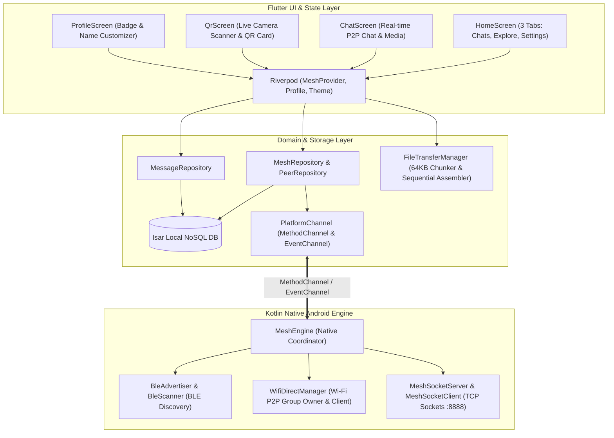

# 🌐 MeshLink

<div align="center">


**100% Off-Grid, Serverless Peer-to-Peer Mesh Messaging & High-Speed Media Sharing for Android**

*No Internet. No Cell Towers. No Central Servers. Pure Wireless Freedom.*

[Key Features](#-key-features) • [Architecture](#-system-architecture) • [UI Flow & Screens](#-ui-flow--screens) • [Installation & Build](#-installation--build) • [Technical Docs](DOCUMENTATION.md)

</div>

---

## 📖 Overview

**MeshLink** is an open-source decentralized messaging and multimedia sharing application built with **Flutter** and **Native Kotlin Platform Channels**. It leverages **Wi-Fi Direct (P2P)** and **Bluetooth Low Energy (BLE)** to establish autonomous wireless links between Android devices, enabling instant, high-speed, private chat and file transfer without any internet connectivity or external infrastructure.

---

## ✨ Key Features

- 📡 **100% Offline Communication**: Send and receive instant text messages, photos, videos, and documents without mobile data, SIM cards, or Wi-Fi routers.
- ⚡ **Dual-Channel Wireless Engine**: Low-power BLE beacons for background presence discovery paired with high-speed Wi-Fi Direct (P2P) sockets (up to 250+ Mbps) for instant chat and file delivery.
- 📁 **High-Speed Offline File & Media Transfer**:
  - **Photos & Images**: Instant in-chat full-size viewing.
  - **Videos**: Integrated **In-App Video Player** with custom playback controls and external hardware player fallback for 4K/HEVC.
  - **Documents**: Share PDFs, ZIPs, DOCs, APKs, and audio files with native Android `FileProvider` "Open with..." integration.
  - **Save to Storage**: Save received attachments directly to public device storage (`Download/MeshLink/`).
- 🛑 **Interactive Cancel Send**: Tap `[✕ Cancel]` on the transfer progress bar at any time to abort an in-flight transfer and automatically purge incomplete chunks from both devices.
- 🎨 **Warm Cream / Deep Dark Theme System**:
  - **Warm Light Theme**: Soothing cream & beige background (`#F6F3EC`), ivory cards (`#FDFBF7`), lush emerald accents (`#00896B`), and espresso typography (`#231F1C`).
  - **Deep Dark Theme**: Sleek charcoal (`#0B0F14`), slate cards (`#151B23`), vibrant mint (`#00D4A8`), and crisp white text.
- 💬 **WhatsApp-Style Chat & Message Controls**:
  - Hold-to-delete individual messages with instant on-device database synchronization.
  - Separate "Delete Conversation" (clears chat history) and "Forget Friend" (removes pairing).
- 📷 **Pure QR Pairing**: Streamlined 2-tab pairing (**Scan QR** with live camera / gallery decoder + **My QR** with avatar badge and node fingerprint).
- 🗄️ **Persistent Local Storage**: Offline conversation history and saved peers powered by an embedded **Isar NoSQL Database**.

---

## 🏛 System Architecture



> 📘 *For in-depth sequence diagrams, protocol specifications, and FAQs, see [DOCUMENTATION.md](DOCUMENTATION.md).*

---

## 📱 UI Flow & Screens

```
[Splash Screen] ──► [HomeScreen] (AppBar: 'MeshLink')
                           │
       ┌───────────────────┼───────────────────┐
       ▼                   ▼                   ▼
[Tab 0: Chats]     [Tab 1: Explore]    [Tab 2: Settings]
  • WhatsApp List    • Status Pill       • Profile & Badges
  • Media Preview    • Saved Friends     • Warm Light / Dark Switch
  • Hold to Delete   • Nearby Friends    • Node Fingerprint
  • Live Dot (🟢)    • FAB: Scan / QR    • Offline Info
       │                   │                   │
       ▼                   ▼                   ▼
 [Chat Screen]      [QR Screen]        [Profile Screen]
  • In-App Player    • Live Scanner
  • Cancel Send      • My QR Code
  • File Opening     • Gallery Scan
```

---

## 🚀 Installation & Build

### Prerequisites
- [Flutter SDK](https://docs.flutter.dev/get-started/install) (v3.24+ recommended)
- Android SDK (API Level 26+ / Android 8.0 to Android 15)
- Physical Android Devices (Wi-Fi Direct & BLE require hardware wireless radios)

### Clone & Build

```bash
# 1. Clone the repository
git clone https://github.com/Op-Vision17/MeshLink.git
cd MeshLink

# 2. Install Flutter dependencies
flutter pub get

# 3. Build Release Split APKs (Optimized size per architecture)
flutter build apk --split-per-abi
```

The generated APK binaries will be located at:
- `build/app/outputs/flutter-apk/app-arm64-v8a-release.apk` (Recommended for modern 64-bit phones — ~26.6 MB)
- `build/app/outputs/flutter-apk/app-armeabi-v7a-release.apk` (For 32-bit legacy devices — ~22.4 MB)
- `build/app/outputs/flutter-apk/app-x86_64-release.apk` (For emulators — ~29.1 MB)

---

## 📂 Project Structure

```
lib/
├── data/
│   ├── datasources/        # Isar NoSQL, Platform Channel & FileTransferManager
│   ├── models/             # Local peer, message, and packet models
│   └── repositories/       # Repository implementations
├── domain/
│   ├── entities/           # ChatMessage, PeerNode, MeshEvent entities
│   └── repositories/       # Clean architecture repository contracts
├── presentation/
│   ├── providers/          # Riverpod state notifiers (Mesh, Profile, Theme)
│   └── screens/            # HomeScreen (3 Tabs), ChatScreen, QrScreen, ProfileScreen
├── utils/
│   ├── app_colors.dart     # Centralized Warm Cream & Deep Dark theme tokens
│   └── app_theme.dart      # Material 3 Light & Dark ThemeData
└── main.dart               # App entry point & ProviderScope initialization
```

---

## 🔒 Privacy & Permissions

MeshLink requests only permissions strictly necessary for offline peer-to-peer operation:
- **Bluetooth & Nearby Devices**: For broadcasting and detecting local peer presence.
- **Location**: Required by Android OS for Wi-Fi Direct and BLE hardware discovery (never used for GPS tracking).
- **Camera / Storage**: Optional, used only for scanning QR codes and selecting media to share.

---

## 📄 License

This project is licensed under the [MIT License](LICENSE).
