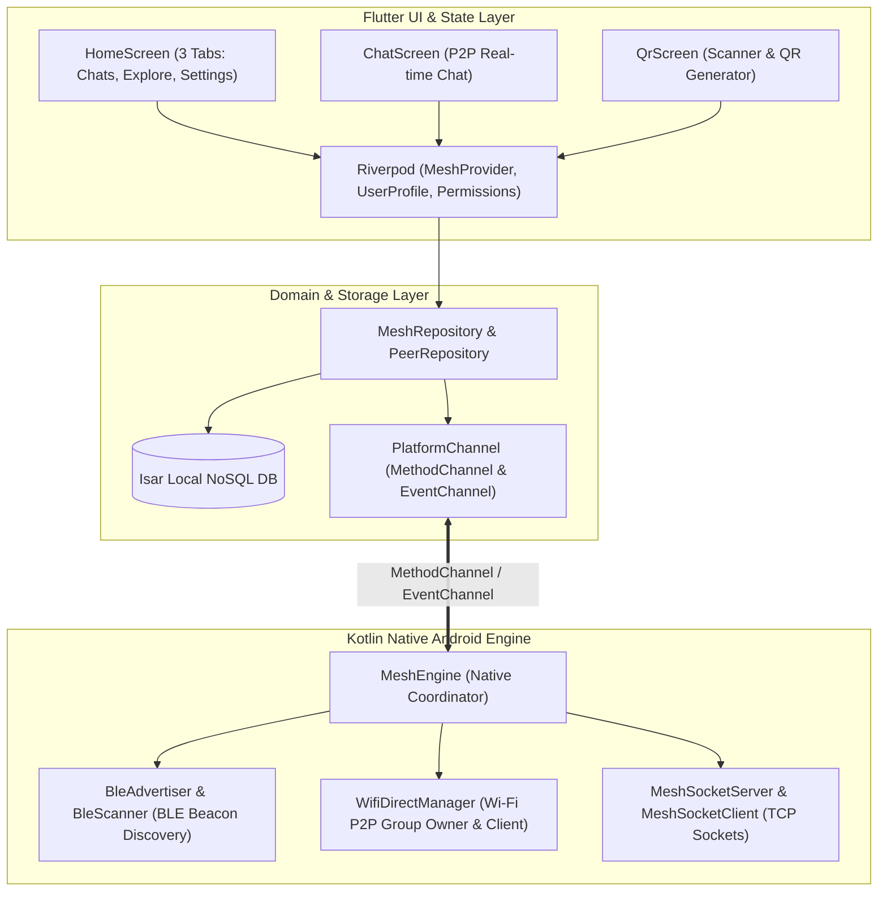

# 🌐 MeshLink

<div align="center">


**100% Off-Grid, Serverless Peer-to-Peer Mesh Messaging for Android**

*No Internet. No Cell Towers. No Central Servers. Pure Wireless Freedom.*

[Key Features](#-key-features) • [Architecture](#-system-architecture) • [Screenshots & UI Flow](#-ui-flow--screens) • [Installation & Build](#-installation--build) • [Technical Docs](DOCUMENTATION.md)

</div>

---

## 📖 Overview

**MeshLink** is an open-source decentralized messaging app built with **Flutter** and **Native Kotlin Platform Channels**. It harnesses **Wi-Fi Direct (P2P)** and **Bluetooth Low Energy (BLE)** to create local wireless mesh links between Android devices, enabling instant, real-time, private chat without any internet connectivity or external infrastructure.

---

## ✨ Key Features

- 📡 **100% Offline Communication**: Send and receive instant messages completely off-grid without mobile data or Wi-Fi routers.
- ⚡ **Dual-Channel Discovery**: Hybrid Bluetooth Low Energy (BLE) beacons for background presence detection combined with high-speed Wi-Fi Direct P2P sockets for data transmission.
- 🎨 **Centralized Theme System**: Full dynamic **Light Theme** (Emerald `#00A982` + White `#FFFFFF`) and **Dark Theme** (Mint `#00D4A8` + Deep Slate `#151B23`).
- 🏠 **Clean 3-Tab Architecture**:
  - **💬 Chats**: WhatsApp-style conversation list showing clean display names, message snippets, timestamps, and connection status dots.
  - **📡 Explore**: Real-time searching status pill (`● Searching` / `● Connected`), "Find Friends Nearby" search toggle, nearby devices list, and a **`Scan / QR` Floating Action Button**.
  - **⚙️ Settings**: Real-time **Display Name Edit & Save**, **Light ☀️ / Dark 🌙 Mode Switch**, and mesh information.
- 📷 **Instant QR Code Pairing**: Add friends seamlessly via camera QR scan, personal QR code display, or manual 8-character Friend Code.
- 🗑️ **"Forget Friend" Management**: Easy removal of saved peers with confirmation dialogs.
- 🗄️ **Persistent Local Storage**: Offline conversation history powered by on-device **Isar NoSQL Database**.

---

## 🏛 System Architecture



> 📘 *For in-depth protocol specifications and sequence diagrams, check [DOCUMENTATION.md](DOCUMENTATION.md).*

---

## 📱 UI Flow & Screens

```
[Splash Screen] ──► [HomeScreen] (AppBar: 'MeshLink' only)
                           │
       ┌───────────────────┼───────────────────┐
       ▼                   ▼                   ▼
[Tab 0: Chats]     [Tab 1: Explore]    [Tab 2: Settings]
  • WhatsApp List    • Find Friends      • Edit Name
  • Display Name     • Nearby Friends    • Light/Dark Switch
  • Live Dot (🟢)    • FAB: Scan / QR    • Offline Info
       │                   │
       ▼                   ▼
 [Chat Screen]      [QR Screen]
```

---

## 🚀 Installation & Build

### Prerequisites
- [Flutter SDK](https://docs.flutter.dev/get-started/install) (v3.24+ recommended)
- Android SDK (API Level 24+ / Android 7.0 to Android 15)
- Physical Android Devices (Wi-Fi Direct & BLE require hardware wireless chips)

### Clone & Build

```bash
# 1. Clone the repository
git clone https://github.com/Op-Vision17/MeshLink.git
cd MeshLink

# 2. Install Flutter dependencies
flutter pub get

# 3. Build Release Split APKs (Optimized size per architecture)
flutter build apk --split-per-abi
```

The generated APK binaries will be located at:
- `build/app/outputs/flutter-apk/app-arm64-v8a-release.apk` (Recommended for modern 64-bit phones)
- `build/app/outputs/flutter-apk/app-armeabi-v7a-release.apk` (For 32-bit legacy devices)
- `build/app/outputs/flutter-apk/app-x86_64-release.apk` (For emulators)

---

## 📂 Project Structure

```
lib/
├── data/
│   ├── datasources/        # Isar NoSQL & Platform Channel data sources
│   ├── models/             # Local peer, message, and packet models
│   └── repositories/      # Repository implementations
├── domain/
│   ├── entities/           # ChatMessage, PeerNode, MeshEvent entities
│   └── repositories/       # Clean architecture repository contracts
├── presentation/
│   ├── providers/          # Riverpod state notifiers (Mesh, Profile, Permission)
│   └── screens/            # HomeScreen (3 Tabs), ChatScreen, QrScreen, SplashScreen
├── utils/
│   ├── app_colors.dart     # Centralized Light & Dark theme tokens
│   └── app_theme.dart      # Material 3 Light & Dark ThemeData
└── main.dart               # App entry point & ProviderScope initialization
```

---

## 🔒 Privacy & Permissions

MeshLink asks only for permissions essential to offline wireless operation:
- **Bluetooth & Nearby Devices**: For broadcasting & discovering local presence beacons.
- **Location**: Required by Android OS for Wi-Fi Direct and BLE hardware discovery (never sent to any server).
- **Camera**: Optional, only used when scanning a friend's QR code.

---

## 📄 License

This project is licensed under the [MIT License](LICENSE).
